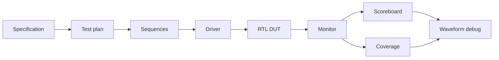

<p align="center">
  
</p>

<p align="center">
  <a href="https://github.com/Nam24-dot?tab=repositories"></a>
  <a href="https://github.com/Nam24-dot/apb4-uvm-lab"></a>
  <a href="https://github.com/Nam24-dot/systemverilog-sva-protocol-checkers"></a>
  
</p>

<p align="center">
  
</p>

## Xin chào, tôi là Văn Đình Nam

Tôi định hướng trở thành **Design Verification Engineer**, tập trung vào `SystemVerilog`, `UVM`, `SVA`, constrained-random testing, functional coverage và waveform debugging. Tôi thích biến một yêu cầu kỹ thuật thành test plan rõ ràng, stimulus có chủ đích và bằng chứng có thể chạy lại.

```yaml
focus: Design Verification Engineer
verification:
  - SystemVerilog, UVM, SVA
  - constrained-random, scoreboard, monitor, coverage
  - regression, waveform debug, protocol compliance
protocols:
  - AMBA APB4
  - AMBA AXI4
rtl_fpga:
  - Verilog, RISC-V RV32I, MMIO, AES accelerator
  - QuestaSim, ModelSim, Quartus, Intel FPGA
tools:
  - Synopsys VCS, Verdi, Python, C, shell scripting
```

## Verification Journey



## Repo Nổi Bật

| Repository | Minh chứng nhanh | Vì sao đáng xem |
| --- | --- | --- |
| [APB4 UVM Lab](https://github.com/Nam24-dot/apb4-uvm-lab) | Toy DUT, UVM agent, random sequence, driver, monitor, scoreboard, coverage, script QuestaSim | Repo nhỏ gọn để chạy và review luồng UVM end-to-end |
| [SystemVerilog SVA Protocol Checkers](https://github.com/Nam24-dot/systemverilog-sva-protocol-checkers) | APB4 assertions, positive test và intentional negative test | Thể hiện cách assertion phát hiện vi phạm timing và control |
| [APB4 & AXI4 Verification Portfolio](https://github.com/Nam24-dot/apb4-axi4-uvm-verification-portfolio) | Scenario matrix, assertions, scoreboard flow, coverage strategy | Tóm tắt phương pháp verification protocol ở mức public, không chứa tài liệu nội bộ |
| [RISC-V Pipeline with AES Accelerator](https://github.com/Nam24-dot/RISC-V_5-state_pipelined_with_AES_implemented_on_FPGA_DE10_Standard) | CPU pipeline, AES MMIO, UART bootloader, testbench, waveform, FPGA flow | Minh chứng RTL integration và verification từ IP đến hệ thống |
| [Graduation Project Documentation](https://github.com/Nam24-dot/Bao_cao_do_an_tot_nghiep_new) | Kiến trúc IP, QuestaSim, waveform, Quartus, FPGA bring-up | Giúp người xem đánh giá quy trình triển khai và tài liệu kỹ thuật |

## Kinh Nghiệm Verification

### APB4 & AXI4 Verification Environment

Trong kỳ thực tập Design Verification, tôi làm việc với verification environment cho APB4 và kiểm tra AXI4 bằng VIP. Phạm vi gồm handshake, response, burst, ordering, alignment, boundary, constrained-random scenarios, SystemVerilog assertions, waveform debugging và coverage analysis.

Các repository public ở đây chỉ chứa ví dụ nguyên bản và mô tả phương pháp; không chứa RTL, verification IP, waveform, log hay tài liệu nội bộ của doanh nghiệp.

## Graduation Project: RISC-V CPU + AES

<p>
  
  
  
  
</p>

SoC FPGA tích hợp CPU RISC-V 32-bit pipeline `IF/ID/EX/MEM/WB`, forwarding, load-use stall, branch/jump flush, register-file writeback, MMIO path, bộ tăng tốc AES và UART bootloader.

| Hạng mục kiểm thử | Kết quả |
| --- | ---: |
| Lệnh RISC-V được kiểm thử | `39` |
| Random ISA checks | `700` |
| CPU-AES end-to-end vectors | `50` |
| AES UVM random regression | `PASS` |
| CPU UVM end-to-end regression | `PASS` |
| MMIO functional coverage | `100%` |

## Toolbox

<p align="center">
  
  
  
  
  
  
  
  
  
  
</p>

## Đánh Giá Nhanh

1. Chạy [APB4 UVM Lab](https://github.com/Nam24-dot/apb4-uvm-lab) để xem constrained-random flow và scoreboard.
2. Chạy positive/negative tests trong [SVA Protocol Checkers](https://github.com/Nam24-dot/systemverilog-sva-protocol-checkers) để xem assertion bắt lỗi.
3. Mở [RISC-V Pipeline with AES Accelerator](https://github.com/Nam24-dot/RISC-V_5-state_pipelined_with_AES_implemented_on_FPGA_DE10_Standard) để xem RTL, UVM regression và FPGA workflow.
4. Đọc [APB4 & AXI4 Verification Portfolio](https://github.com/Nam24-dot/apb4-axi4-uvm-verification-portfolio) để xem test strategy và coverage plan.

## GitHub Overview

<p align="center">
  
  
</p>

<p align="center">
  
</p>

---

<p align="center">
  <strong>Specification to stimulus to coverage to debug.</strong><br />
  SystemVerilog | UVM | SVA | Coverage | APB4 | AXI4 | RTL | FPGA
</p>
