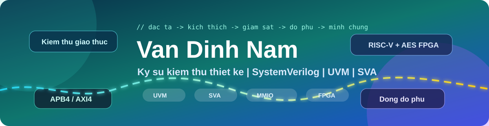
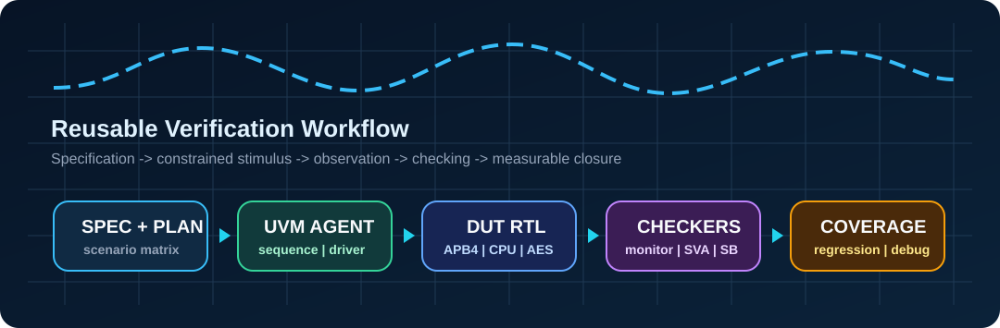
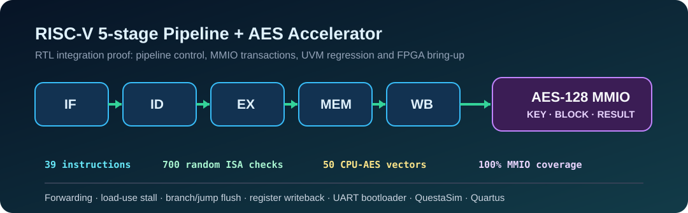

<p align="center">
  
</p>

<h1 align="center">
  Hi, I am Van Dinh Nam
  
</h1>

<p align="center">
  <strong>Design Verification · IC Design · RTL · FPGA</strong>
</p>

<p align="center">
  <a href="https://github.com/Nam24-dot?tab=repositories"></a>
  <a href="https://www.linkedin.com/in/v%C4%83n-%C4%91%C3%ACnh-nam-561689254/"></a>
  
  
</p>

<p align="center">
  <a href="https://github.com/Nam24-dot/apb4-uvm-lab"></a>
  <a href="https://github.com/Nam24-dot/axi4-lite-uvm-lab"></a>
  <a href="https://github.com/Nam24-dot/systemverilog-sva-protocol-checkers"></a>
  <a href="https://github.com/Nam24-dot/RISC-V_5-state_pipelined_with_AES_implemented_on_FPGA_DE10_Standard"></a>
</p>

<p align="center">
  
</p>

> **Mission:** I build engineering portfolios that are easy to verify: runnable source code, structured testbenches, assertions that catch real violations, measurable coverage and reproducible simulation results.

<p align="center">
  
</p>

## 🧭 Technical Profile

I am pursuing a career as a **Design Verification Engineer**. My electronics and telecommunications background helps me approach hardware systems from RISC-V microarchitecture and AMBA bus protocols to comprehensive UVM verification workflows.

```yaml
name: Van Dinh Nam
target_role: Design Verification Engineer
focus:
  - SystemVerilog, UVM, SVA, constrained-random testing
  - scoreboard, monitor, functional coverage, regression, waveform debug
  - AMBA APB4, AXI4-Lite, protocol compliance
  - Verilog RTL, RISC-V RV32I pipeline, MMIO, AES accelerator
tools:
  - Synopsys VCS, Verdi, QuestaSim, ModelSim, Quartus
  - Python, C, shell scripting
```

## 🚀 Featured Repositories

| Repository | Technical evidence | Why it matters |
| --- | --- | --- |
| [apb4-uvm-lab](https://github.com/Nam24-dot/apb4-uvm-lab) | APB4 slave, sequence item, constrained-random sequence, driver, monitor, scoreboard, coverage and QuestaSim scripts | Compact end-to-end UVM lab that is easy to run and review |
| [axi4-lite-uvm-lab](https://github.com/Nam24-dot/axi4-lite-uvm-lab) | AXI4-Lite master/slave RTL, five `AW/W/B/AR/R` channels, reactive driver, SVA and regression | Demonstrates verification of independent handshake channels |
| [systemverilog-sva-protocol-checkers](https://github.com/Nam24-dot/systemverilog-sva-protocol-checkers) | APB4 assertions, positive tests and intentional negative tests | Shows an assertion catching the `PENABLE requires PSEL` violation |
| [apb4-axi4-uvm-verification-portfolio](https://github.com/Nam24-dot/apb4-axi4-uvm-verification-portfolio) | UVM architecture, scenario matrix, scoreboard flow, assertion checklist and coverage strategy | Public overview of a protocol verification methodology |
| [RISC-V Pipeline with AES](https://github.com/Nam24-dot/RISC-V_5-state_pipelined_with_AES_implemented_on_FPGA_DE10_Standard) | CPU pipeline, AES MMIO, UART bootloader, unit tests, UVM regression, waveforms and Quartus flow | Main proof of RTL integration, verification and FPGA prototyping |
| [Graduation Project Documentation](https://github.com/Nam24-dot/Bao_cao_do_an_tot_nghiep_new) | IP architecture, QuestaSim guide, waveforms, Quartus synthesis and FPGA bring-up | Technical documentation for a fast project review |
| [EFR32xG21 AHT20 Monitor](https://github.com/Nam24-dot/The-temperature-and-humidity-measurement-system-uses-EFR32xG21.) | Non-blocking firmware, BLE, UART and sensor integration | Adds embedded systems and device communication experience |

## 🧪 Verification Evidence

### APB4 UVM Lab

```text
Random Sequence → Driver → APB4 DUT → Monitor → Scoreboard
                                      └──────→ Coverage
```

Validated with `QuestaSim 10.2c`:

```text
APB4_UVM_LAB_PASS checks=43
```

### SystemVerilog Assertions

| Property | Purpose |
| --- | --- |
| `penable_requires_psel` | The access phase must not occur before the slave is selected |
| `setup_advances_to_access` | The setup phase must advance to the access phase |
| `control_stable_while_waiting` | Control signals must remain stable while waiting for `PREADY` |
| `control_known_when_selected` | Control signals must not contain unknown values |

Simulation output:

```text
APB4_SVA_POSITIVE_TEST_PASS
APB4 violation: PENABLE requires PSEL
```

## ⚙️ RISC-V CPU and AES Accelerator

<p align="center">
  
</p>

The FPGA SoC integrates a 32-bit RISC-V pipeline with `IF/ID/EX/MEM/WB` stages, forwarding, load-use stall handling, branch/jump flush logic, register-file writeback, an MMIO path, an AES accelerator and a UART bootloader.

| Verification target | Result |
| --- | ---: |
| Tested RISC-V instructions | `39` |
| Random ISA checks | `700` |
| CPU-AES end-to-end vectors | `50` |
| AES UVM random regression | `PASS` |
| CPU UVM end-to-end regression | `PASS` |
| MMIO functional coverage | `100%` |

## 🧰 Toolbox

<p align="center">
  
  
  
  
  
  
  
  
  
  
</p>

## 🔎 Quick Review Path

1. Run [APB4 UVM Lab](https://github.com/Nam24-dot/apb4-uvm-lab) to inspect the constrained-random flow and scoreboard.
2. Run [AXI4-Lite UVM Lab](https://github.com/Nam24-dot/axi4-lite-uvm-lab) to inspect independent handshake-channel handling.
3. Run the positive and negative tests in [SVA Protocol Checkers](https://github.com/Nam24-dot/systemverilog-sva-protocol-checkers) to see assertions detect violations.
4. Open [RISC-V Pipeline with AES](https://github.com/Nam24-dot/RISC-V_5-state_pipelined_with_AES_implemented_on_FPGA_DE10_Standard) to review RTL, UVM regression and the FPGA workflow.

## 📊 GitHub Activity

<p align="center">
  
</p>

## 🤝 Connect

I am interested in opportunities in **Design Verification**, **RTL Verification**, **IC Design** and **FPGA** engineering.

<p align="center">
  <a href="https://www.linkedin.com/in/v%C4%83n-%C4%91%C3%ACnh-nam-561689254/"></a>
  <a href="https://github.com/Nam24-dot"></a>
</p>

---

<p align="center">
  <strong>Specification → stimulus → coverage → debug → proof.</strong><br />
  SystemVerilog · UVM · SVA · APB4 · AXI4-Lite · RTL · FPGA
</p>
